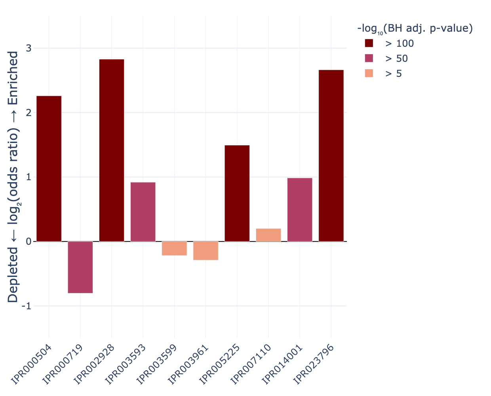
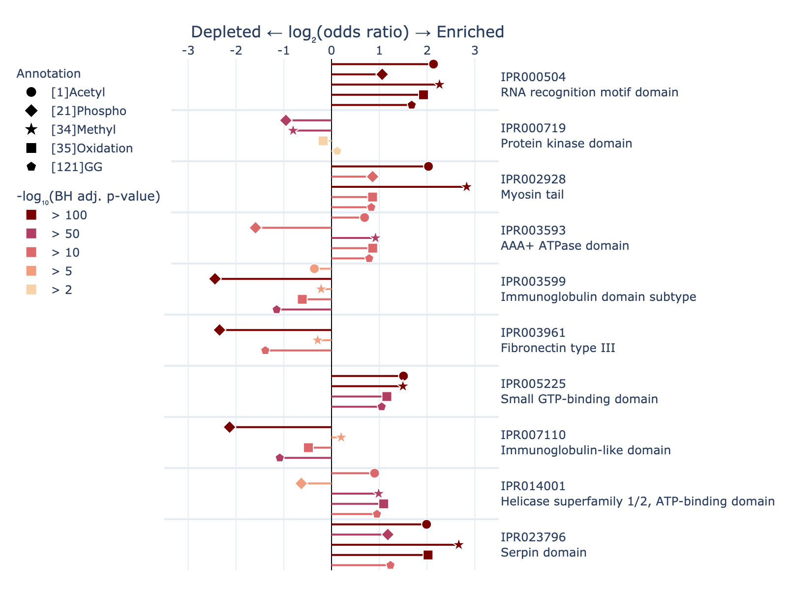
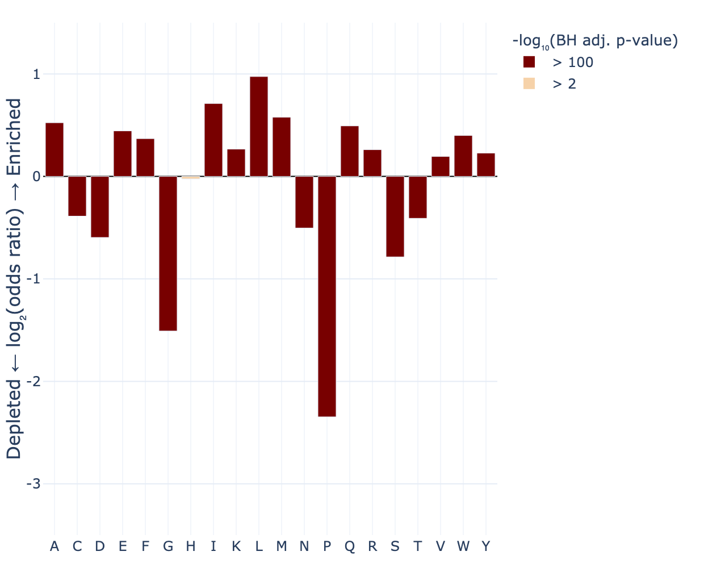
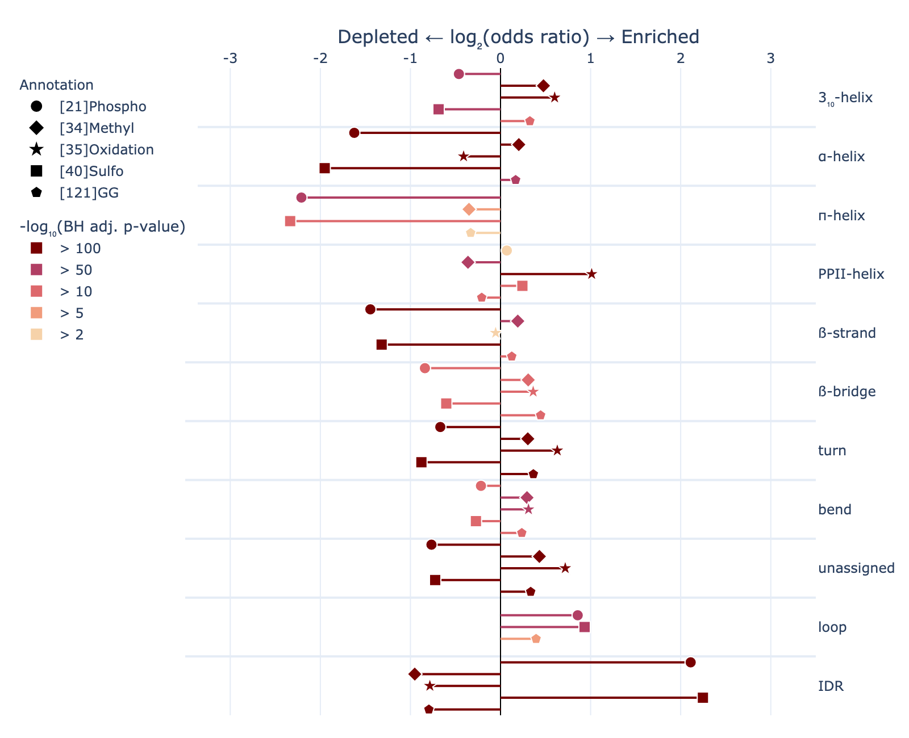
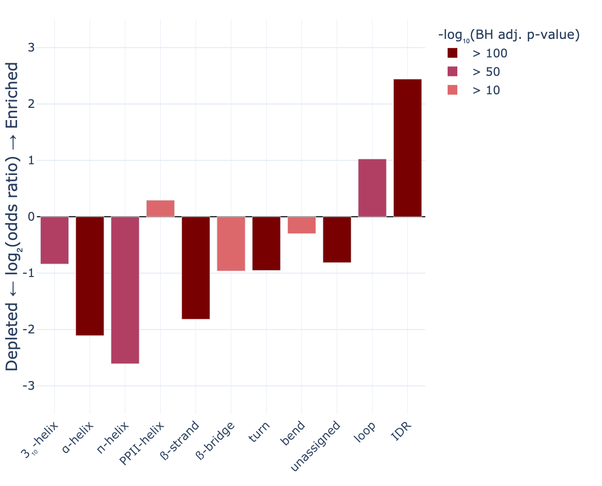
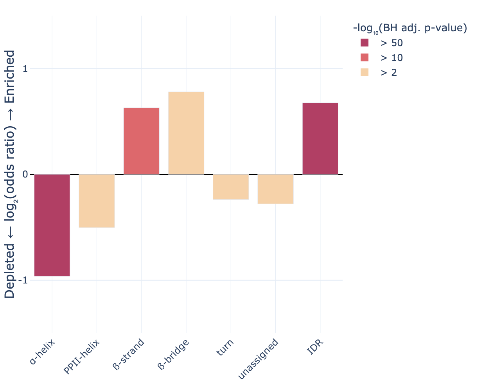
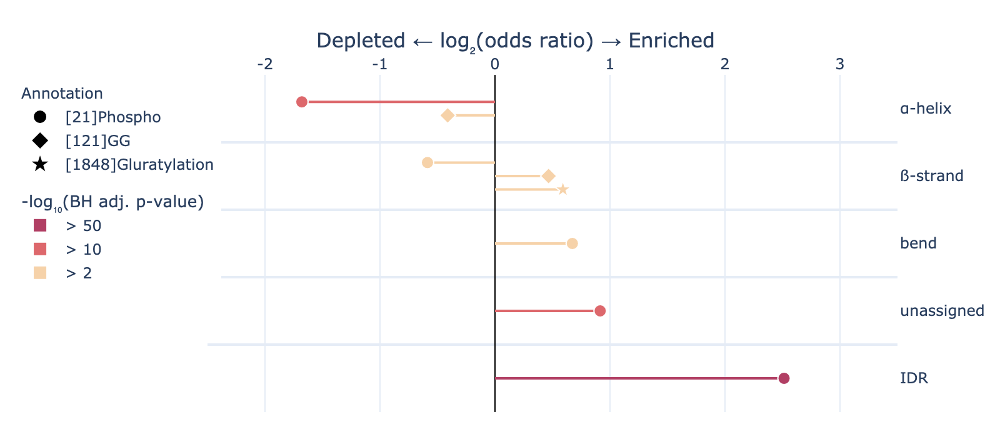
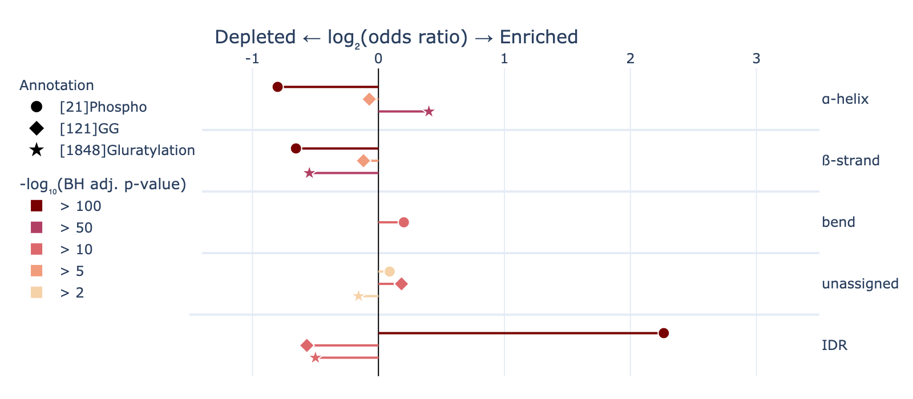

# A Comprehensive analyses of Protein Modifications from a Conformational Perspective
This README guides you through setting up and using the **protmodcon** toolkit for analysing **prot**ein **mod**ifications with a focus on **con**formational context. The workflow enables enrichment calculations and visualisations across four annotation categories:
* amino acid identity
* secondary structure
* domains
* modifications

## 1. Set Up Your Environment
Create a virtual environment on your local PC. Please ensure your system has at least 8GB of RAM and that you have Python 3.13.3 (or a compatible version) installed. The scripts usually take at most a few minutes to run.
## 2. Clone the Repository
## 3. Calculate Enrichment of Protein Modifications
Run the main analysis script from the terminal:
```
python protmodcon.py --x-types ptm_name --y-types domain
```
This command assesses the enrichment of all modifications (ptm_name) across all domains in the dataset.
This command also creates a file, ptm_name_IN_domain_proteome_wide.csv, within the results_protmodcon directory.
## 4. Visualize Enrichment Results
Use the visualisation script to plot enrichment data:
* Single Annotation Visualisation:

This command plots the enrichment of methylation across 10 domains (that were found to be most extensively modified), applying Benjamini-Hochberg correction with a default threshold of 0.01.
```
python visualise_protmodcon.py --data results_protmodcon/ptm_name_IN_domain_proteome_wide.csv --x "[34]Methyl" --y IPR000719 IPR007110 IPR000504 IPR003599 IPR005225 IPR002928 IPR023796 IPR003961 IPR003593 IPR014001 --output 4_1.png
```

* Multiple (up to 5) Annotations Visualisation
```
python visualise_protmodcon.py --data results_protmodcon/ptm_name_IN_domain_proteome_wide.csv --x "[1]Acetyl" "[21]Phospho" "[34]Methyl" "[35]Oxidation" "[121]GG" --y IPR000719 IPR007110 IPR000504 IPR003599 IPR005225 IPR002928 IPR023796 IPR003961 IPR003593 IPR014001 --output 4_2.png
```

## 5. Optional: Explore Modifications Across All Proteins
The file data/protein_id_annotation_position.json lists all 20,059 proteins, their identified modifications, and other annotations.
## 6. Additional Notes
For further customisation, refer to the script help menus:
```
python protmodcon.py --help
python visualise_protmodcon.py --help
```
If you use protmodcon in your research, please cite the repository. You can contact the maintainer via GitHub Issues for support, feature requests, or any related questions.
## 7. Figures and Corresponding Code
The following figures are presented in direct correspondence with those included in my master’s dissertation. Each figure is accompanied by the respective code utilised for its generation. Only results with -log10(BH adj. p-value) > 2 are shown.

### 7.1. Proteome-wide phosphorylation enrichment analyses at the primary sequence level, restricted to amino acids exhibiting at least one phosphorylation identified by ionbot.
```
python protmodcon.py --x-types ptm_name --y-types AA
python visualise_protmodcon.py --data results_protmodcon/ptm_name_IN_AA_proteome_wide.csv --x "[21]Phospho" --y C D E H K R S T Y --output 7_1.png
```


### 7.2. Enrichment analyses of primary amino acids within α-helices. 
```
python protmodcon.py --x-types AA --y-types sec
python visualise_protmodcon.py --data results_protmodcon/AA_IN_sec_proteome_wide.csv --x AHELX --output 7_2.png
```


### 7.3. Enrichment analyses of the five most frequently identified modifications across all secondary conformational elements.
```
python protmodcon.py --x-types ptm_name --y-types sec
python visualise_protmodcon.py --data results_protmodcon/ptm_name_IN_sec_proteome_wide.csv --x "[21]Phospho" "[34]Methyl" "[35]Oxidation" "[40]Sulfo" "[121]GG" --output 7_3.png
```


### 7.4. Enrichment analyses of Ser/Thr (top figure) and Tyr phosphorylation (bottom figure) across secondary conformational elements. 
```
python protmodcon.py --x-types ptm_name --y-types sec --modifiability "[21]Phospho:S,T"
python visualise_protmodcon.py --data results_protmodcon/ptm_name_Phospho-S-T_IN_sec_proteome_wide.csv --x "[21]Phospho" --output 7_4_1.png 
```

```
python protmodcon.py --x-types ptm_name --y-types sec --modifiability "[21]Phospho:Y"
python visualise_protmodcon.py --data results_protmodcon/ptm_name_Phospho-Y_IN_sec_proteome_wide.csv --x "[21]Phospho" --output 7_4_2.png
```


### 7.5. Enrichment analyses of the five most frequently identified domain-wide modifications within the ten most prevalent protein domains.
```
python protmodcon.py --x-types ptm_name --y-types domain
python visualise_protmodcon.py --data results_protmodcon/ptm_name_IN_domain_proteome_wide.csv --x "[1]Acetyl" "[21]Phospho" "[34]Methyl" "[35]Oxidation" "[121]GG" --y IPR000719 IPR007110 IPR000504 IPR003599 IPR005225 IPR002928 IPR023796 IPR003961 IPR003593 IPR014001 --output 7_5.png
```


### 7.6. Enrichment analyses of phosphorylation, ubiquitination ([121]GG) and glutarylation in protein kinase domains (top figure) and proteome-wide (excluding protein kinase domains, bottom figure).
```
python protmodcon.py --x-types ptm_name --y-types sec --domain-ids IPR000719
python visualise_protmodcon.py --data results_protmodcon/ptm_name_IN_sec_IPR000719_proteome_wide.csv --x "[21]Phospho" "[121]GG" "[1848]Gluratylation" --output 7_6_1.png
```

```
python protmodcon.py --x-types ptm_name --y-types sec --domain-ids (all except IPR000719)
python visualise_protmodcon.py --data results_protmodcon/ptm_name_IN_sec_IPR034526_IPR007725_IPR033698_IPR003692_IPR037716_and_more.csv  --x "[21]Phospho" "[121]GG" "[1848]Gluratylation" --y AHELX STRAND BEND unassigned IDR --output 7_6_2.png
```
